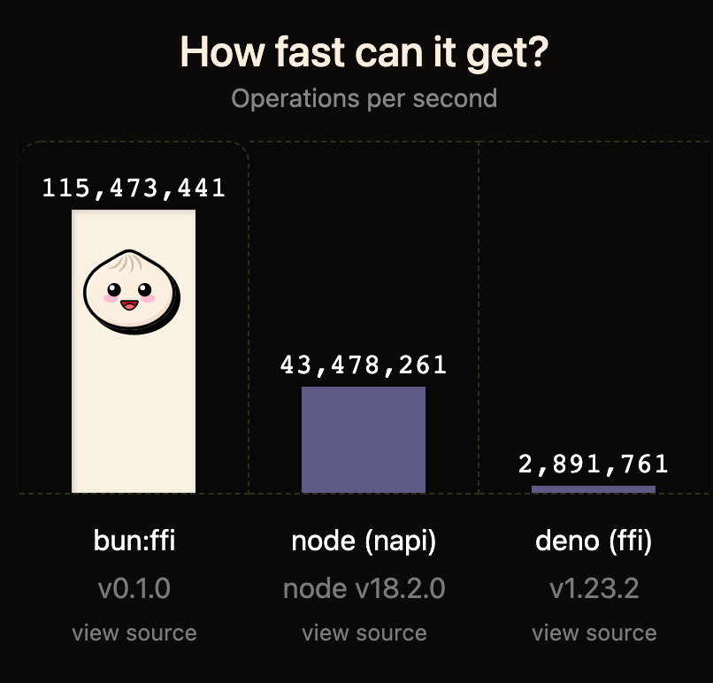
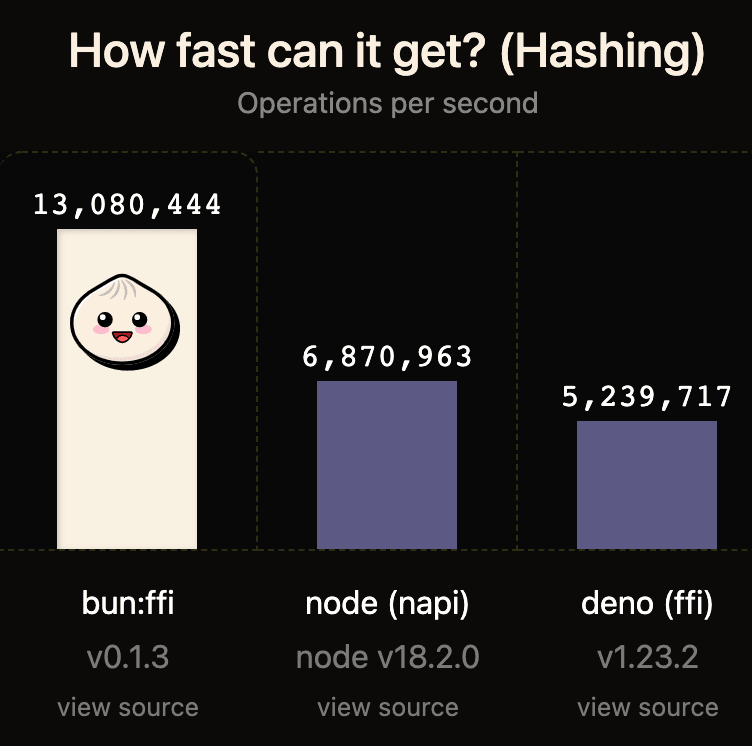
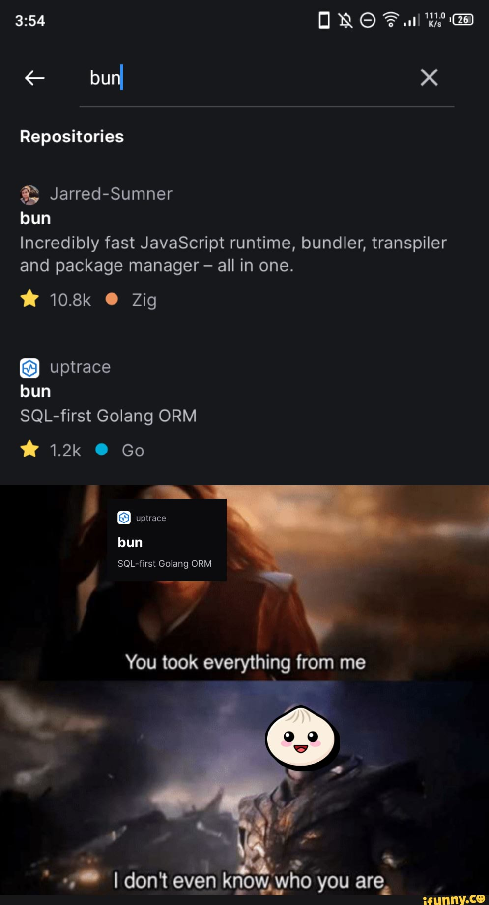

<h1>Bun: A brand-new, lightning-quick JavaScript runtime</h1>


</br></br>
<h2>What is Bun? 🤔</h2>
</br>

Bun is built on Zig and has the ability to transpile, set up, and run TypeScript and JavaScript projects. It is a full utility since it also functions as a package manager. That’s why it’s referred to as all-in-bun. This has been made possible via the usage of Zig, a dated programming language that was initially created for video games.
</br></br>

</br></br>

Notably, a bun produces another ***bun.lockb*** file, which is not comparable to a standard typical *yarn.lock* or *package-lock.json* file. The lock file that goes along with it is produced in binary. Exactly why? due to performance-related factors. This can make it difficult to track changes in common PRs.

<h2>Performance 🏃‍♂️</h2>
</br>
People now refer to it as blazingly fast instead of just fast.

What could be better than a detailed examination of some of its benchmarks in comparison to NodeJs and Deno:
</br></br>
**Comparison of React’s server-side rendering *:***
</br></br>

</br></br>
In SSR of React, Bun is unquestionably more than **3 times faster** 🚀 in handling http requests.
</br></br>
**Comparison in terms of Hashing :**
</br></br>

</br></br>
Bun has a staggering **6.3 times higher average** 😮 query throughput than deno and nodeJs, respectively.
</br></br>
<h2>Support ⛷️</h2>
</br>
Numerous Node.js and Web APIs, such as fs, path, Buffer, and others, are natively supported by Bun. This means that many npm packages already in use will be run by bun.

</br></br>

</br></br>

Through improved, more user-friendly tooling, Bun wants to run the majority of JavaScript outside of browsers, increasing infrastructure complexity and speed.

- **TypeScript with JSX?** It will work. (even .tsconfig support).
- Bun **loads.env files** for you automatically.
- **Node modules?** No issue.
- There are built-in web APIs like **fetch** and **WebSocket**
- **Run a test?** We possess it. It’s also quick.
- **Package manager?** It soars.
</br></br>
<h2>Getting started 🎬</h2>
</br>

Run this [install script](https://bun.sh/install) in your terminal to install Bun. From GitHub, Bun is downloaded.

```
curl https://bun.sh/install | bash
```

**Create a react app 🔨**

Run the command below to create a react app right away.
```
bun create react bun-app
```
It will create a new directory with the name of your app. To start the app run the following command
```
cd your-app-name
bun dev
```


**Build production bundle for react app 🏗️**

React-scripts is not included by default with Bun, therefore you must first install it.
```
bun a react-scripts -d
```
It is set up in this place as a dev dependency.
Run the subsequent command to create the production bundle after that.
```
bun react-scripts build
```
The production bundle will be created when you issue the aforementioned command, and it will be saved in the build directory.
</br></br>
**Adding** scripts **to your package.json 📜**

The scripts listed below can be included in our package.json file.
```
{
  "scripts": {
    "start": "bun dev",
    "build": "react-scripts build"
  }
}
```
To launch the app, issue the following command.
```
bun start
```
And to create the production bundle, we may issue the following command.
```
bun run build
```
**App ✨**
</br></br>

</br></br>
**Bonus 💰**

*Bun builds react apps by default with javascript, however typescript can be used by simply changing the file extension from .jsx to .tsx.*
</br></br>
<h2>Conclusion 💭</h2>

It’s admirable that Bun.js has lofty goals for the future. Although it is currently too early to declare that it will replace Node.js, that is its intended replacement. Although Bun.js performs insanely, it tries to replace a lot of tools at once, which puts a heavy pressure on the Bun.js developers. Additionally, Zig is not a very well-known programming language, making it difficult, in my opinion, to find a contributor.
</br></br>

</br></br>


It will take years for Bun.js to mature and become a technology that we can use in production applications because it is still too new and immature. Even so, it has a lot of potential.
</br></br>
<h2>Github URL for the app 💻</h2>

<https://github.com/devangtomar/bun-app>

</br>

<h2 align="left">Let's connect and chat! Open to anything under the sun.</h2><br>
<p align="left">
<a href="https://twitter.com/devangtomar7" target="blank"></a>
<a href="https://www.linkedin.com/in/devangtomar" target="blank"></a>
<a href="https://stackoverflow.com/users/8198097/devangtomar" target="blank"></a>
<a href="https://instagram.com/be_ayushmann" target="blank"></a>
<a href="https://medium.com/@devangtomar123" target="blank"></a>
</p>
<br>
